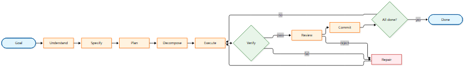
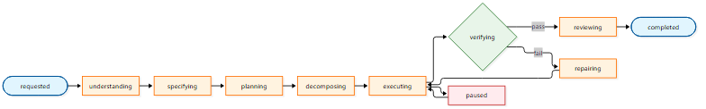
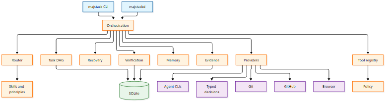
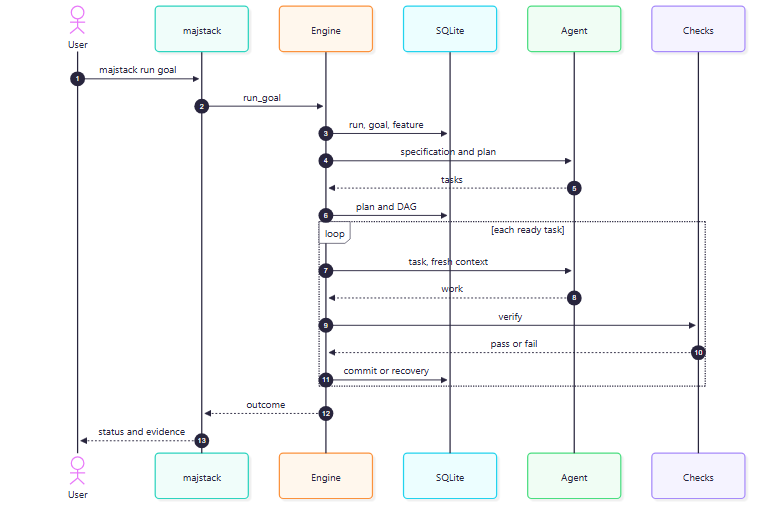
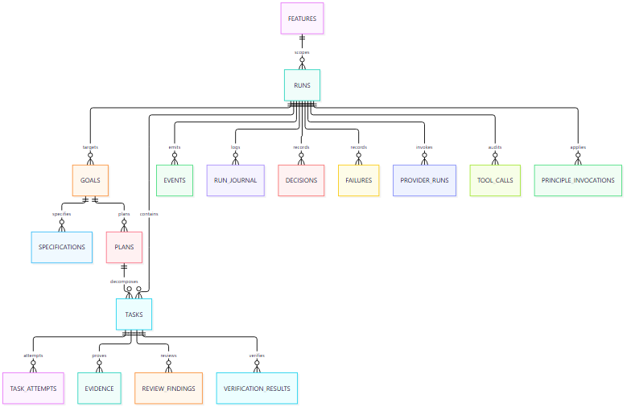
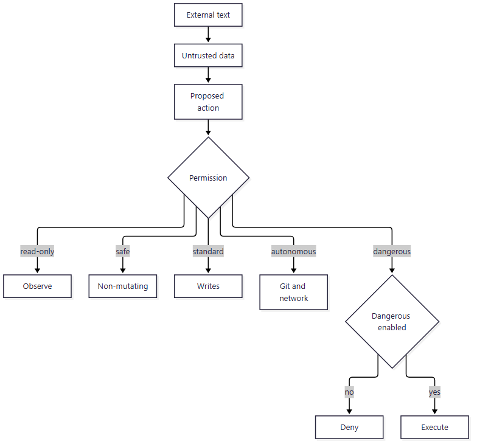
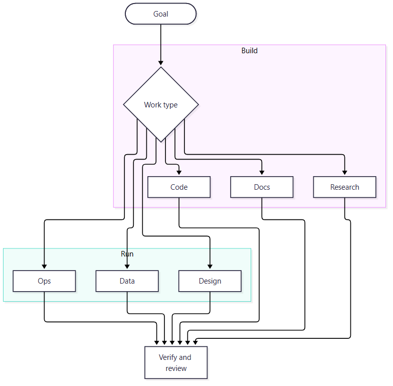

# majstack

**An autonomous AI engineer — as a tool, not a model.** majstack runs locally and orchestrates
the AI coding agents and models you already use. Give it a goal; it works out how to
investigate, plan, decompose, build, test, review, debug, verify, retry, re-plan, and finish the
job. No coding required and no workflow to choose — for developers and non-developers alike.

It has no model of its own. It drives your agent CLIs and endpoints (Claude Code, Codex,
OpenCode, or any OpenAI-compatible API) and turns a goal into verified results, with real
state, real execution, real verification, and real evidence. Think "orchestration tool that acts
like an engineer," not "another AI model."

## Install

Linux / macOS:

```bash
curl -fsSL https://raw.githubusercontent.com/theabdlmjd/majstack/main/install.sh | sh
```

Windows (PowerShell):

```powershell
irm https://raw.githubusercontent.com/theabdlmjd/majstack/main/install.ps1 | iex
```

Or with Rust:

```bash
cargo install --git https://github.com/theabdlmjd/majstack majstack-cli majstack-daemon
```

Binaries are self-contained: SQLite is compiled in and every skill, workflow, and principle is
embedded. No server, no API key, no configuration service.

## Quickstart

```bash
cd your-repo
majstack init
majstack doctor
majstack run "add CSV export to the reports page" --verify "npm test"
majstack status
majstack logs
```

`majstack init` detects `claude`, `codex`, or `opencode` on your PATH and writes it into
`.majstack/config.toml`. Any CLI works via `[agents.*]`.

## How it works

<p align="center"></p>

Each iteration starts a clean model context. Durable state lives in SQLite and context is
rebuilt from a token budget.

## Run lifecycle

<p align="center"></p>

## Components

<p align="center"></p>

## One autonomous run

<p align="center"></p>

## Data model

<p align="center"></p>

## Security and permissions

<p align="center"></p>

More diagrams (database schema, context assembly, distribution):
[`docs/architecture/overview.md`](docs/architecture/overview.md).

## Beyond coding

The engine is goal -> plan -> DAG -> execute -> verify, so the deliverable does not have to be
code. Any work that can be planned, chunked, executed, and checked works.

<p align="center"></p>

| Domain | Example goal | A check that proves it |
|---|---|---|
| Documentation | "write the API reference from the source" | link check plus file exists |
| Research | "compare these approaches and write findings" | required sections plus citations |
| Operations | "write and validate the deploy runbook" | `bash -n runbook.sh` |
| Data | "clean this dataset and produce a summary" | row and schema validation script |
| Writing | "turn these notes into a launch post" | target sections present |

Bundled non-code workflows: `research`, `data-analysis`, `ops-runbook`, `content`.

## Any model

- **Executor:** any agent CLI. `[agents.*]` with `cmd = [...]`.
- **Decisions:** `[typed]` selects a backend: a hosted typed-decision model, or any
  OpenAI-compatible endpoint (Ollama, vLLM, llama.cpp, LM Studio, OpenRouter). With none
  enabled, the deterministic keyword router runs.

## Capabilities

- **Autonomy** — event-driven run state machine, fresh context per iteration, retries with
  limits, pause and resume, crash recovery.
- **Planning** — spec and plan artifacts per feature, a real task DAG with dependencies, atomic
  claims, automatic unblocking, parent roll-up, and phase-skip resume.
- **Execution** — any agent CLI, model strategies, role-based routing, and true parallelism:
  swarm in isolated worktrees, arena with competing contestants, and review panels.
- **Verification** — typecheck, lint, tests, and build with recorded evidence, content
  fingerprints, and independent review verdicts.
- **Recovery** — failure classification, strategy adaptation, model or provider switching,
  scope reduction, re-planning, and escalation.
- **Memory** — knowledge search, a per-iteration run journal, a decision trail, and a
  token-budgeted context builder.
- **Principles** — machine-readable rules scoped to each stage, with traceable invocations.
- **Safety** — an auditable tool registry, five permission levels, destructive-command guards,
  edit boundaries, untrusted-input handling, and secret redaction. No telemetry.
- **Git and GitHub** — branches, commits, worktrees, merges, issues, pull requests, checks, and
  babysitting.
- **Browser** — a real Chrome DevTools Protocol driver with screenshots and console capture.
- **Beyond coding** — research, data, operations, documentation, and design workflows with the
  same verification and evidence.

## Commands

```
majstack init                 seed .majstack/ and pick an agent
majstack run <goal>           autonomous run
majstack resume [run]         continue a paused run
majstack pause                stop after the current step
majstack status               run states
majstack tasks                task list
majstack graph                task DAG as Mermaid
majstack logs                 persisted event stream
majstack journal              per-iteration journal
majstack features             feature lifecycle and spec/plan paths
majstack decisions            decision trail
majstack evidence             evidence freshness
majstack route <request>      chosen work type and workflow
majstack swarm / arena / panel
majstack pr open|checks|babysit|merge
majstack browse <url> [--shot name]
majstack install-skills --host claude|codex|opencode|cursor|factory|kiro
majstack agents / tools / skills / workflows / providers / doctor
```

Every command supports `--json`.

## Distribution

- **Binary:** the autonomous engine (`majstack`, `majstackd`).
- **Skills only:** `majstack install-skills --host <host>` writes the skills as plain
  `SKILL.md` files into your agent's native skill directory, with no orchestrator at runtime.

## Privacy and security

- **No telemetry.** majstack does not phone home or send your code anywhere. The only network
  calls are the ones you configure: your agent CLI, an optional decision backend, and GitHub
  commands you invoke.
- **Local state only.** Everything lives in `.majstack/` inside your repository.
- **Permissions.** Five levels (read-only, safe, standard, autonomous, dangerous), enforced per
  tool. Destructive commands are blocked in careful mode; edit boundaries can be frozen.
- **Untrusted input.** Repository files, issue text, PR comments, CI output, and web pages are
  treated as data, never instructions.
- **Secrets.** Log records pass through a redaction filter; outbound actions are recorded in a
  tamper-evident ledger.

See `SECURITY.md`.

## Status

1.0. The engine, DAG scheduler, fresh-context execution, features and spec/plan artifacts, run
journal, verification, review, recovery, tool registry, browser subsystem, GitHub integration,
parallelism, typed decisions, specialist roles, and daemon are implemented and tested. Remaining
depth is tracked in `docs/PLAN.md`.

## Contributing

`cargo fmt --all -- --check`, `cargo clippy --workspace --all-targets -- -D warnings`, and
`cargo test --workspace` must pass. Do not claim a capability is implemented
until it works and is tested.

## License

MIT. See `NOTICE.md` for attribution.
