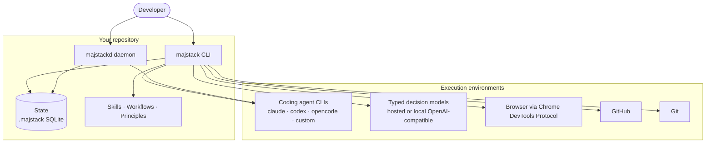
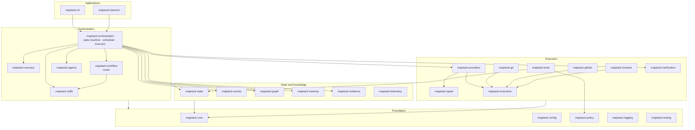
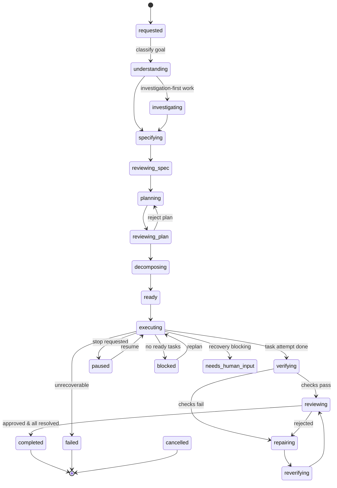
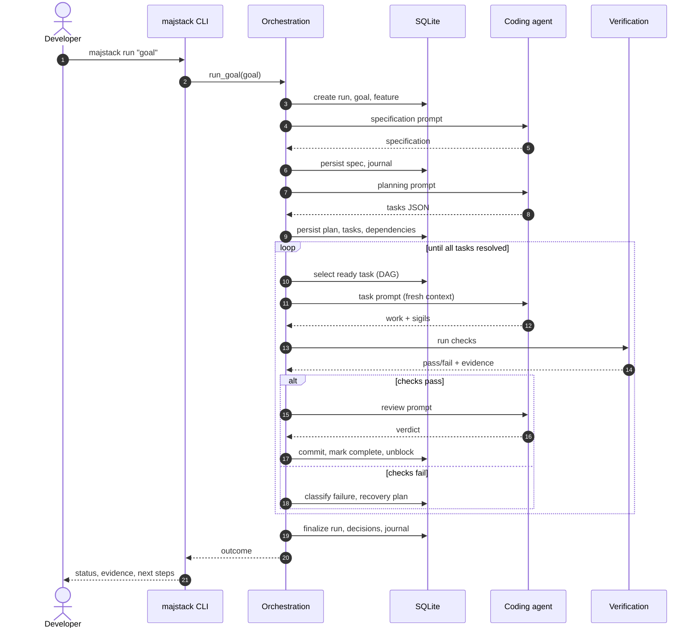
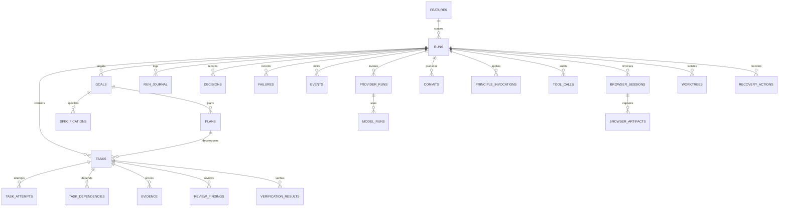
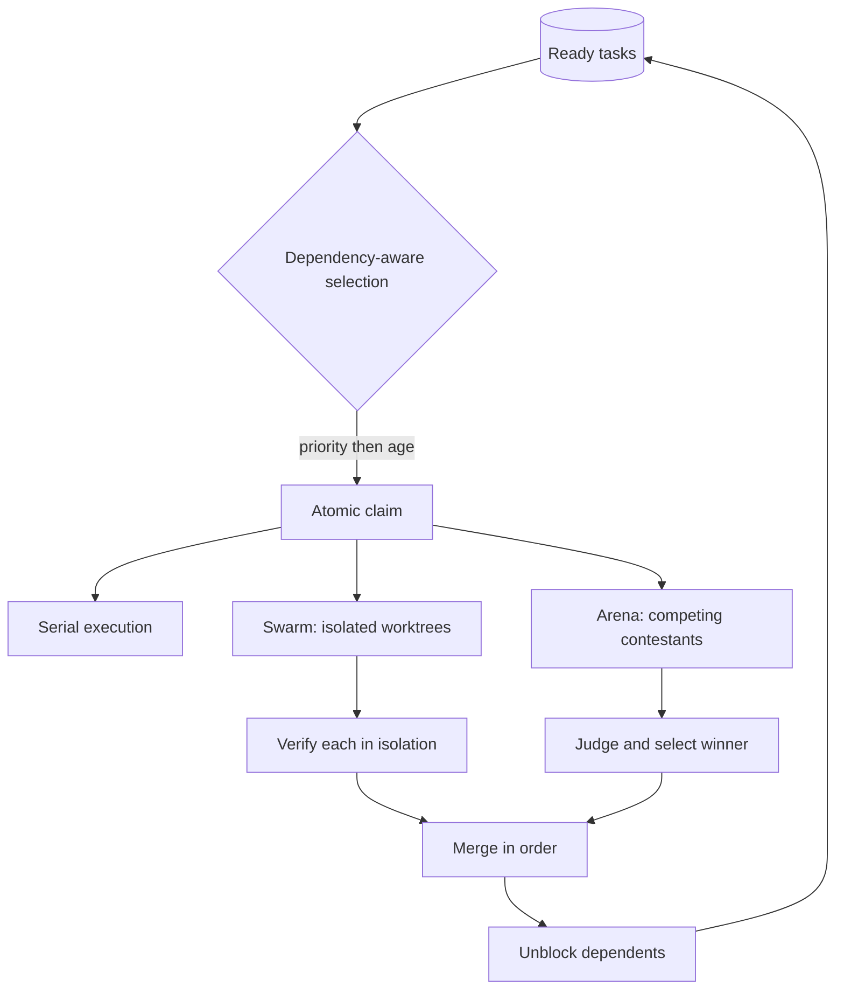
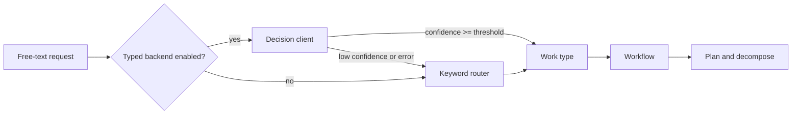
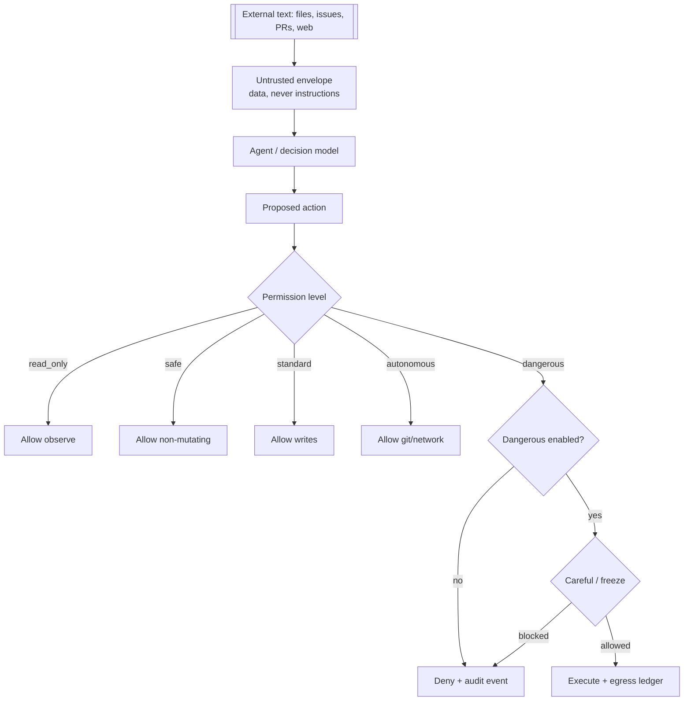
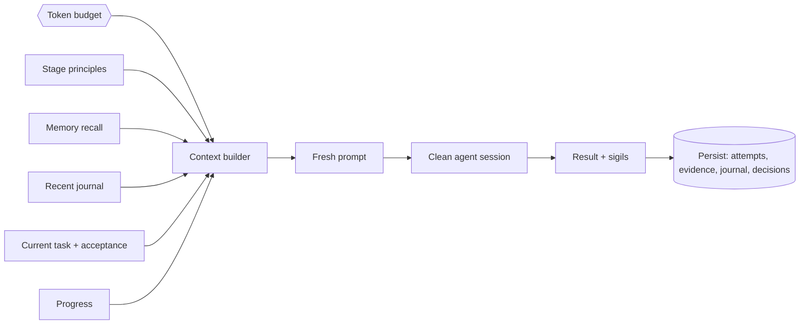
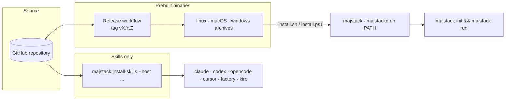

# Architecture

majstack turns a high-level goal into verified software changes. It is an orchestration engine:
real state, real execution, real verification, real recovery, and real evidence.

## 1. System context

## 2. Component graph

## 3. Run state machine

## 4. One autonomous run (sequence)

## 5. Persistence schema

## 6. Scheduling and parallelism

## 7. Decision flow (typed models)

## 8. Security and permissions

## 9. Context assembly per iteration

## 10. Distribution

